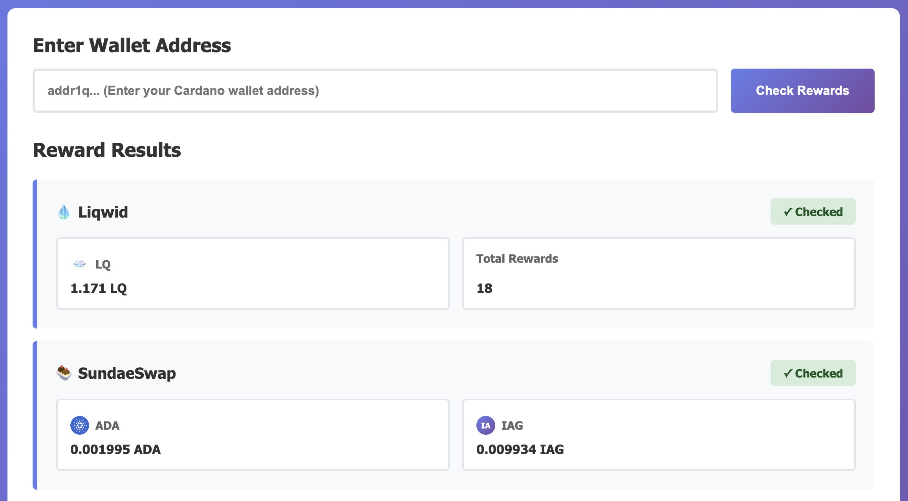

# Cardano Reward Checker

Check pending rewards from multiple Cardano DeFi protocols by entering your wallet address.

**🌐 Live App: https://simonschubert.github.io/cardano-rewards/**

## Supported Providers

### Liqwid (via SundaeSwap)
- **Token**: LQ (Liqwid Token)
- **Type**: Liquidity mining rewards
- **Claim**: [Liqwid Rewards on SundaeSwap](https://liqwid-rewards.sundaeswap.finance)

### SundaeSwap
- **Token**: ADA and other tokens
- **Type**: Liquidity provider fees
- **Claim**: [SundaeSwap App](https://app.sundae.fi/)

### Nuvola Digital
- **Token**: IAG, COPI, USDM, FACT and others
- **Type**: Staking pool rewards
- **Claim**: [Nuvola Digital App](https://app.nuvoladigital.io)

### Minswap
- **Token**: MIN and staking rewards
- **Type**: Staking and liquid staking rewards
- **Claim**: Visit Minswap (check manually)

### Cardano Staking
- **Token**: ADA
- **Type**: Delegation rewards available for withdrawal
- **Claim**: [Eternl Wallet](https://eternl.io/app/mainnet/dashboard) or any wallet

## How to Use

1. Enter your Cardano wallet address
2. Click "Check Rewards"
3. View pending rewards from all supported providers
4. Click provider links to claim rewards

## Features

- Real-time reward checking across multiple protocols
- Token icons and formatted amounts
- Direct links to claim rewards

## Todo

- Support for multiple wallet addresses
- Support more providers
